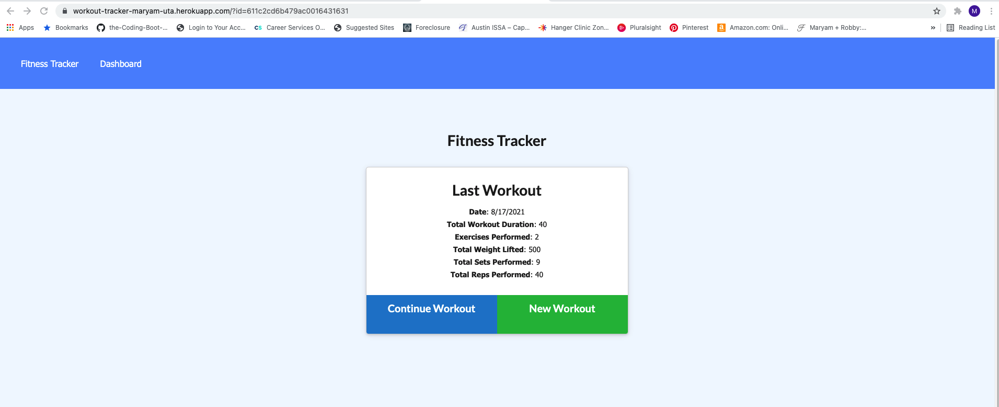

# workout-tracker

## User Story
As a user, I want to be able to view create and track daily workouts. I want to be able to log multiple exercises in a workout on a given day. I should also be able to track the name, type, weight, sets, reps, and duration of exercise. If the exercise is a cardio exercise, I should be able to track my distance traveled.

## Description
Allows a user to track all of their cardio and resistance workouts and provides them with a few metrics on how they are doing.

## Heroku Deployed Link
https://workout-tracker-maryam-uta.herokuapp.com/

## GitHub Link
https://github.com/mguppy/workout-tracker

Credits: w3schools.com, my tutor, classmates